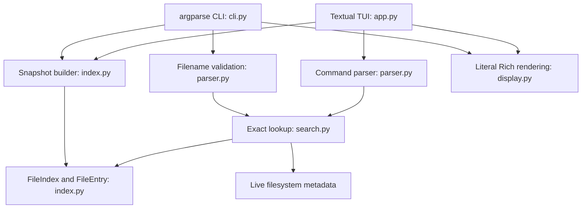

# Architecture

## Baseline

At `ae2b9a0`, `programa/grep_tui.py` contained a single `GrepFileApp` class. Startup
ran `os.listdir(".")`, filtered with `os.path.isfile`, sorted names, and called
`os.stat` to populate a nested metadata dictionary. Input handling checked
`startswith("grep ")`, sliced the remaining string, ran binary search, and rendered
a Rich table. The index had no refresh; directory errors could stop startup and
metadata could be stale. No application code existed in the old C scaffold.

## Current design

Modules are small and organized by responsibility; there are no plugin backends,
repositories, service containers, or watcher frameworks. The package has a `src/`
layout to make installation explicit and avoid importing the checkout by accident.
`programa/grep_tui.py` remains a compatibility launcher after package installation.
Its six original empty files remain useful demo inputs, not test dependencies.

## Index and search invariants

`build_index(Path)` resolves the chosen directory and reads immediate children.
One `stat` call checks each entry's type and metadata. Regular files are included;
directories and other file types are excluded. Links to regular files are followed,
including targets outside the indexed directory, matching the baseline behavior.
Broken links and inaccessible entries produce `IndexWarning` records.

The returned frozen dataclasses hold sorted tuples: `names[i]` always corresponds
to `entries[i]`. Only `build_index` constructs application snapshots. `binary_search`
requires the same case-sensitive ascending ordering and returns a position or `-1`.
`find_file` indexes directly into the aligned tuple and re-reads metadata of a match.
No dictionary membership bypasses the educational algorithm.

A deleted or inaccessible indexed file raises `FileAccessError`; a file replaced
by a directory also fails explicitly. New filenames require refresh. Metadata is
timezone-aware UTC. Filesystem state can change immediately after any check; the
application reports observations rather than promising an atomic filesystem view.

## Errors and refresh

- `CommandSyntaxError`: invalid keyword, argument count, quoting, or filename.
- `FileIndexError`: the directory scan failed; the original OS error is chained.
- `IndexWarning`: one entry could not be indexed; remaining readable entries stay usable.
- `FileAccessError`: a matched snapshot entry can no longer be inspected.

The TUI scans using `asyncio.to_thread` in a Textual worker. Only a completed snapshot
replaces the old one on the UI thread. Concurrent refresh requests are coalesced,
and input is temporarily disabled during refresh. A failed refresh retains the
previous snapshot and displays an error; help and quit shortcuts remain available.
Cancelled workers cannot publish new snapshots, although an in-progress OS call in
a thread can continue until it returns. A matched file's single `stat` remains
synchronous; an unusually slow network filesystem can delay that result.

The CLI uses the same index and lookup functions. Exit codes are `0` found, `1`
absent from the snapshot, and `2` invalid input or filesystem failure. Per-entry
warnings go to stderr. TUI and CLI display external strings through literal Rich
`Text` and expose terminal control/format characters rather than interpreting them.

## Complexity and trade-off

Let `m` be directory entries, `n` indexed regular files, and `L` maximum filename
length. Ignoring variable OS latency and bounded-length string comparisons:

| Operation | Time | Additional space |
| --- | --- | --- |
| Scan, filter, read metadata | O(m) | O(m), including skipped-entry warnings |
| Sort and construct snapshot | O(n log n) | O(n) |
| Initial index / full refresh | O(m + n log n) | O(m + n) |
| Binary lookup in prepared names | O(log n) | O(1) |
| Successful lookup | O(log n) + one metadata read | O(1) |

String comparison can cost O(L), giving O(L n log n) sorting and O(L log n)
binary lookup in the worst case. Parsing is linear in command length. The index
stores names/paths and metadata, never file contents. Byte storage additionally
depends on total filename/path length. Refresh briefly retains old and new snapshots,
still linear space. A fresh CLI process always pays the index cost before searching.

A `set`/`dict` provides average O(1) membership after O(n) expected construction,
with hashing and memory costs and worst-case O(n) lookup. It would be a reasonable
practical choice for exact membership. We retain binary search as the single backend
because the sorted-data invariant and explicit algorithm strengthen this project's
educational purpose; two backends would add complexity without a demonstrated need.

See [performance](performance.md) for measured smoke benchmarks and their limits.
The UI tests use Textual's documented [headless testing API](https://textual.textualize.io/guide/testing/).
